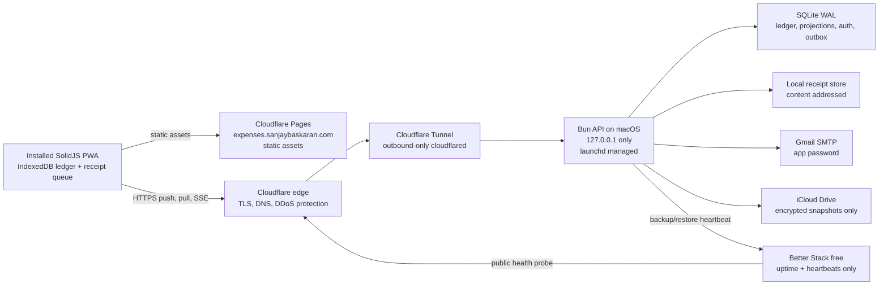

# Fast, zero-incremental-cost infrastructure plan

Status: accepted architecture after infrastructure grilling
Date: July 25, 2026
Product: offline-first shared-expense PWA

## 1. Decision summary

Build the product as a local-first SolidJS PWA with a Bun/SQLite synchronization server running on the existing M1 MacBook Pro.

The production PWA shell is deployed as static assets to Cloudflare Pages at `expenses.sanjaybaskaran.com`. The Mac exposes only the API through Cloudflare Tunnel at `api.expenses.sanjaybaskaran.com`. Consequently, the interface can still open quickly when the Mac is unavailable, and a previously authenticated phone can continue creating signed ledger operations in IndexedDB. Synchronization resumes when the Mac returns.

The intended incremental infrastructure cost for v1 is **$0/month**, excluding costs already being paid for the domain, home internet, electricity, and existing iCloud storage. The design deliberately accepts manual recovery after a cold reboot and has no paid uptime SLA.

## 2. Production topology



When the Mac is down, Pages continues serving the application shell. An existing device reads its own origin-bound IndexedDB data and accepts new local operations. New account verification, new-device login, synchronization, invitations, and receipt upload wait for the API.

## 3. Selected stack

| Layer | Choice | Reason |
|---|---|---|
| Language | TypeScript end to end | One schema and tooling language; fastest implementation path |
| UI | SolidJS | Fine-grained DOM updates with no component-wide rerender requirement |
| Build | Vite run with Bun | Mature PWA plugin ecosystem and fast local builds |
| Styling | Tailwind CSS | Compiled static CSS; no runtime styling engine |
| Accessible primitives | Selective Kobalte components | Dialog, menu, select, and popover behavior without a full visual suite |
| PWA | `vite-plugin-pwa` / Workbox | App-shell caching, upgrades, and offline routing |
| Phone database | IndexedDB through Dexie | Durable, queryable browser storage that works without a network |
| HTTP server | Native `Bun.serve()` routes | Minimal framework overhead and one runtime process |
| Server database | Native `bun:sqlite` | Direct prepared SQLite access with no domain ORM |
| Authentication | Better Auth | Self-hosted sessions, Solid client, Bun SQLite, verification, and recovery |
| Live updates | Server-Sent Events | Lightweight notification channel; durable data still uses resumable HTTPS sync |
| Email | Generic SMTP adapter configured for Gmail | No provider-specific application dependency |
| Public ingress | Cloudflare Tunnel | No router port-forwarding or exposed home IP |
| Static production host | Cloudflare Pages | Free edge delivery and app-shell availability during Mac outages |
| Process supervision | macOS `launchd` | Native M1 execution, crash restart, and no Docker Desktop VM |
| Portable packaging | Docker Compose | Future OSS deployment path, exercised in CI rather than used on this Mac |
| CI | GitHub Actions in a public repository | Standard hosted runners are free for public repositories |
| Monitoring | Better Stack free tier | External uptime checks and job heartbeats only |
| Backup | SQLite online snapshots, encrypted and copied to iCloud Drive | Off-device copies without another paid storage service |

## 4. Why this is the fastest practical stack

### User-perceived latency

The critical expense-entry path never waits for the server:

1. Validate the entry on the phone.
2. Append a signed operation and update the local projection in one IndexedDB transaction.
3. Render the result immediately through Solid's fine-grained reactivity.
4. Synchronize in the background when the API is reachable.

This architecture removes home-internet latency and Mac availability from the save interaction. IndexedDB is explicitly designed for persistent, queryable web applications that work online and offline. Solid updates only the DOM associated with changed reactive state.

### Server throughput

Rust/Axum can win synthetic server benchmarks: Axum's PostgreSQL implementation reached approximately 1.11 million Fortunes responses per second in TechEmpower Round 23. That does not make Rust the best v1 choice here. This application is constrained by SQLite's single-writer model, receives a very small private-beta workload, and performs phone-first local writes. A Rust server would create a second schema/tooling language without improving visible expense-entry latency.

Bun provides a native HTTP server and native SQLite driver in the same runtime. Bun reports its SQLite read path as roughly 3–6 times faster than `better-sqlite3`; that is a vendor benchmark and must be validated with this application's own tests. Even a small fraction of that capacity is far above the expected workload.

### SQLite configuration

Use direct prepared statements and ordered SQL migrations. Domain SQL lives behind a repository layer and never appears in HTTP route handlers.

Production pragmas:

```sql
PRAGMA journal_mode = WAL;
PRAGMA synchronous = FULL;
PRAGMA foreign_keys = ON;
PRAGMA busy_timeout = 5000;
```

WAL lets readers proceed while a writer is active, though SQLite still permits only one writer at a time. Every ledger append, projection update, and related outbox insert uses a short explicit transaction. Long reads are paginated so they do not obstruct checkpoint progress.

## 5. Offline ledger and reconciliation

### Operation model

The financial record is append-only. Examples include:

- `ExpenseCreated`
- `ExpenseAmended`
- `ExpenseVoided`
- `CommentAdded`
- `PaymentRecorded`
- `PaymentReversed`
- `GroupMemberAdded`
- `GroupMemberRemoved`
- `ConflictResolved`

Each operation contains a permanent UUID, instance/group identifiers, actor and device identifiers, target identifier, base version, client timestamp, canonical payload, SHA-256 content hash, and P-256 device signature. Canonical JSON serialization must be deterministic across Bun and browsers.

Edits append amendments; deletions append tombstones. Server sequence numbers establish canonical ordering but never replace client UUIDs.

### Device keys

Each trusted browser generates a non-exportable P-256 key with Web Crypto. The server stores the public key. Signatures prove operation origin but never bypass current membership, device-revocation, input-validation, or conflict checks.

### Synchronization API

- `POST /api/v1/sync/push` — submit an idempotent operation batch.
- `GET /api/v1/sync/pull?after={serverSequence}` — retrieve canonical operations after a cursor.
- `GET /api/v1/sync/events` — SSE sequence-available notifications only.
- `GET /api/v1/sync/manifest` — compare operation UUID/hash ranges after server restoration.
- `POST /api/v1/attachments` — upload accepted-operation attachments separately.
- `GET /health` — disclose only status, version, and server time.

Clients synchronize on launch, network restoration, foregrounding, an SSE notification, and a conservative fallback interval. Missing live notifications are harmless.

### Conflict policy

Independent creations and comments commute. Concurrent changes to money, payer, participants, split rules, currency, or settlement state create an explicit conflict. The UI shows both proposals and requires an authorized resolution operation. Financial fields never use silent last-write-wins behavior.

### Recovery from clients

Trusted devices retain the complete compact ledger for accessible groups, not only unsynchronized operations. Receipt bytes are separately evictable. After a server generation change or older backup restore, clients compare manifests and relay missing signed operations. Duplicate UUID ingestion is harmless.

## 6. Authentication and email

Better Auth owns only authentication tables and its internal database adapter. Expense, group, ledger, balance, attachment, and outbox tables continue to use direct prepared SQL.

Required behavior:

- Invite-only registration.
- Mandatory email verification.
- Signed single-use link with a short-code fallback.
- Successful verification claims the placeholder participant and joins the invited group.
- Automatic sign-in after verification, followed by name/password setup.
- Cookie sessions shared only across the required `expenses.sanjaybaskaran.com` subtree.
- Exact trusted-origin allowlist; never disable CSRF or origin checks.
- Previously verified devices retain an offline device grant.
- Explicit sign-out removes the grant and locally cached financial data.

### Gmail SMTP decision

Gmail SMTP is configured through `smtp.gmail.com:465` with TLS and a Google app password. The `From` header is `expenses@sanjaybaskaran.com`, which is currently a Cloudflare-forwarded alias to a personal Gmail account. This was an explicit accepted choice.

Important launch gate: a forwarding alias is not an authenticated outgoing mailbox, and the domain currently uses strict DMARC alignment. Before inviting users, send test messages to Gmail, Outlook, and iCloud and inspect `Authentication-Results` for SPF, DKIM, and DMARC behavior. The admin UI must display delivery failure rather than claiming an email was sent successfully. Google may expose the underlying Gmail address or reject the alias From behavior.

The app password is normally configured once. Google revokes app passwords after a Google Account password change or manual revocation. Store it outside the repository and never include it in logs, exports, or backup archives.

### Transactional outbox

Creating an invitation and its pending email occurs in one SQLite transaction. An in-process worker sends pending records with bounded exponential backoff and an idempotency key. Restarting the Mac cannot lose queued email.

Gmail is reserved for verification, invitations, password resets, security alerts, and terminal delivery failures. Ordinary expenses and comments remain in the in-app activity feed.

## 7. Attachments and storage

Receipt OCR is out of v1.

The phone corrects orientation, reduces the longest image edge to 1,600 pixels, and encodes WebP or JPEG at approximately 80% quality. The post-compression maximum is 2 MB. The compressed artifact is stored in IndexedDB until the expense operation is accepted and the upload succeeds.

The server addresses files by SHA-256 hash and stores bytes on the local filesystem. SQLite stores metadata, ownership, hash, size, type, status, and operation linkage.

The hosted instance has a configurable 5 GB receipt quota:

- Warn at 70% and 85%.
- At 95%, reject new receipt bytes while continuing all text and ledger operations.
- Leave phone receipts queued until capacity returns.
- Deduplicate identical content.

No expense entry may fail merely because attachment storage is full.

## 8. Backups and restore

The live database and live receipt directory must not be placed inside an iCloud-synchronized folder.

Backup flow:

1. Use SQLite's online backup mechanism to make a consistent database snapshot.
2. Create a receipt manifest and include newly referenced receipt objects.
3. Compress and encrypt the completed backup archive locally.
4. Retain versioned local hourly, daily, and monthly archives.
5. Copy only completed encrypted archives into a dedicated iCloud Drive folder.
6. Emit a Better Stack heartbeat only after the copy is complete.
7. Run a scheduled restore into a temporary directory, validate hashes and SQLite integrity, then emit the restore-test heartbeat.

The backup decryption identity must be stored outside the backup folder, preferably in the user's password manager plus one offline recovery copy.

## 9. Deployment and releases

### Mac services

Two `launchd` agents run after macOS login:

- Bun API bound to `127.0.0.1` only.
- `cloudflared` connector exposing the API hostname.

FileVault remains enabled. After a full power loss or cold reboot, a person must unlock and log into the Mac before services return. Existing phones continue offline entry during this period. Do not enable insecure automatic login.

### Release flow

- Pull requests run tests and receive Cloudflare Pages previews.
- A merge to `main` does not modify the production Mac.
- A version tag creates immutable frontend and API artifacts.
- Manual promotion creates a fresh backup, installs the API artifact, applies additive migrations, restarts the process, and verifies health.
- The matching PWA is promoted only after API health succeeds.
- A failed health check restores the previous API artifact. The pre-deploy database snapshot remains available; migrations should be backward-compatible and additive.
- The sync capability handshake supports at least the previous deployed client protocol.

Do not install OpenShip for v1. Native `launchd` plus the tunnel is smaller and faster on this Mac. Provide and continuously test Docker Compose for OSS users.

## 10. Security and privacy boundaries

- TLS at Cloudflare and through the tunnel.
- No inbound router port or directly reachable home IP.
- Bun binds only to localhost.
- FileVault protects the live database at rest when the Mac is locked or powered off.
- Backup archives receive independent application-level encryption.
- Secure, HTTP-only session cookies and exact trusted origins.
- Better Auth rate limiting plus application-level limits for invitations and sync batches.
- Device signatures for ledger provenance.
- Server authorization on every synchronized operation.
- No end-to-end encryption in v1; it would materially complicate sharing, recovery, projections, and conflict resolution.
- No third-party analytics, session replay, financial event logs, or hosted error collector.
- Rotating local JSON logs redact email addresses, descriptions, notes, amounts, tokens, and filenames.
- Better Stack receives only uptime state and heartbeat timestamps.

## 11. Money movement and currency boundaries

“Settle up” records a signed external payment operation; the application does not move money and stores no card, bank, or payment-provider credentials.

Multiple currencies are supported without a live exchange-rate API. Each expense retains its original amount and currency. If it differs from the group's settlement currency, the creator confirms an explicit conversion rate. That rate is immutable evidence; a correction is another ledger operation. A future optional adapter may suggest rates, but balances must never change retroactively because a market rate changed.

## 12. Observability

The local admin dashboard includes:

- API version and uptime.
- Pending, rejected, and conflicted operation counts.
- Sync latency percentiles.
- Email outbox depth and terminal failures.
- Database, WAL, receipt, and backup storage usage.
- Last local backup, iCloud copy, and restore test.
- Device and session revocation controls.

Better Stack free monitoring covers the PWA hostname, API health endpoint, backup heartbeat, and restore-test heartbeat. It receives no logs or user context.

## 13. Incremental cost model

| Component | Hosted v1 cost | Zero-cost mechanism | Limitation / trigger to reconsider |
|---|---:|---|---|
| Compute | $0 incremental | Existing M1 MacBook Pro | Manual recovery, home power/internet, no SLA |
| Static PWA | $0 | Cloudflare Pages static assets | Free-plan limits and provider dependency |
| Public API ingress | $0 | Cloudflare Tunnel on Free plan | No paid SLA |
| Database | $0 | SQLite on local disk | One writer; move only after measured contention |
| Receipt storage | $0 | Local disk with 5 GB quota | Add object storage only after local capacity pressure |
| Email | $0 | Personal Gmail SMTP app password | Deliverability risk for custom alias; 500/day Gmail limit |
| Monitoring | $0 | Better Stack personal-project tier | External free-tier terms may change |
| Backup target | $0 incremental | Existing iCloud Drive | Not a full archival service; encrypted versioning mitigates risk |
| CI | $0 | Public-repository GitHub Actions standard runners | Artifact storage and nonstandard runners can incur cost |
| Domain | Already owned | Existing domain and new subdomains | Normal domain renewal remains external |

Expected new recurring infrastructure bill: **$0/month**.

### Optional upgrades, not required for v1

| Upgrade | Cost shape | Buy only when |
|---|---|---|
| UPS for Mac and router | One-time hardware purchase | Power interruptions become a recurring operational problem |
| Small VPS | Recurring monthly | Manual outages or home-network availability become unacceptable |
| Authenticated custom-domain mailbox | Recurring monthly | Gmail alias deliverability fails launch tests or professional sender identity becomes mandatory |
| Object storage | Usage-based | Receipt quota becomes a real constraint |
| Managed PostgreSQL | Recurring monthly | Measurements show sustained concurrent-write contention or a second API host is required |
| Native iOS/Android apps | Store/developer fees and maintenance | PWA platform limits block required product behavior |

## 14. Explicit non-goals for v1

- OCR or receipt parsing.
- Native App Store applications.
- Federation between independently hosted instances.
- Actual payment processing.
- Automatic foreign-exchange rates.
- End-to-end encrypted groups.
- Redis, PostgreSQL, a message broker, or S3-compatible storage.
- Kubernetes or OpenShip deployment.
- Hosted analytics or financial event telemetry.
- Automatic production deployment on every merge.

## 15. Production acceptance gates

The v1 is ready for invitees only when all of the following pass:

1. An installed iPhone PWA can create, edit, void, comment on, and settle expenses while the API is unreachable.
2. Operations from two offline devices reconcile without duplication when the API returns.
3. Concurrent financial edits create an explicit conflict rather than silently overwriting data.
4. A client can restore an operation missing from an older server snapshot, and its device signature validates.
5. The Pages-hosted shell loads while the API is down and clearly shows offline/sync-pending state.
6. Gmail verification tests reach Gmail, Outlook, and iCloud; message headers and DMARC outcomes are recorded.
7. Killing the Bun process causes `launchd` to restart it.
8. No service is listening on a public local interface; the tunnel is the only public API ingress.
9. A backup archive restores into a clean temporary directory and passes `PRAGMA integrity_check` plus receipt hash validation.
10. Filling the receipt quota blocks only new attachment bytes, never ledger operations.
11. Logs and monitoring payloads contain no financial descriptions, amounts, email addresses, tokens, or filenames.
12. The previous released PWA remains compatible with the newly promoted API.

## 16. Evidence and primary references

- [SolidJS fine-grained reactivity](https://docs.solidjs.com/advanced-concepts/fine-grained-reactivity)
- [Official JS Framework Benchmark results](https://krausest.github.io/js-framework-benchmark/)
- [MDN: Using IndexedDB](https://developer.mozilla.org/en-US/docs/Web/API/IndexedDB_API/Using_IndexedDB)
- [Bun native HTTP server](https://bun.sh/docs/runtime/http/server)
- [Bun native SQLite](https://bun.sh/docs/runtime/sqlite)
- [SQLite write-ahead logging](https://sqlite.org/wal.html)
- [SQLite: appropriate uses](https://sqlite.org/whentouse.html)
- [TechEmpower Framework Benchmarks Round 23](https://www.techempower.com/benchmarks/)
- [Better Auth SQLite adapter](https://better-auth.com/docs/adapters/sqlite)
- [Better Auth email verification](https://better-auth.com/docs/concepts/email)
- [Better Auth cross-subdomain cookies](https://better-auth.com/docs/concepts/cookies)
- [Google app passwords](https://support.google.com/accounts/answer/185833)
- [Gmail sending limits](https://support.google.com/mail/answer/22839)
- [Gmail send-as aliases](https://support.google.com/mail/answer/22370)
- [Google DMARC alignment requirements](https://support.google.com/mail/answer/14229414)
- [Cloudflare Pages pricing](https://developers.cloudflare.com/pages/functions/pricing/)
- [Cloudflare Pages limits](https://developers.cloudflare.com/pages/platform/limits/)
- [Cloudflare Tunnel for public applications](https://developers.cloudflare.com/tunnel/)
- [Cloudflare plan pricing](https://www.cloudflare.com/plans/)
- [GitHub Actions billing](https://docs.github.com/en/billing/concepts/product-billing/github-actions)
- [Better Stack pricing](https://betterstack.com/pricing)
